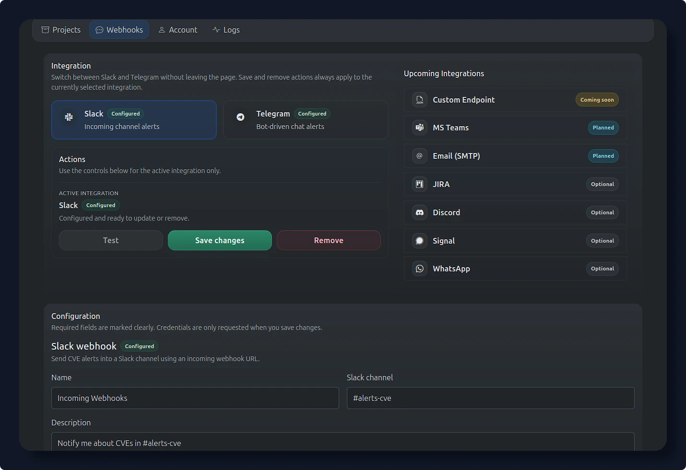
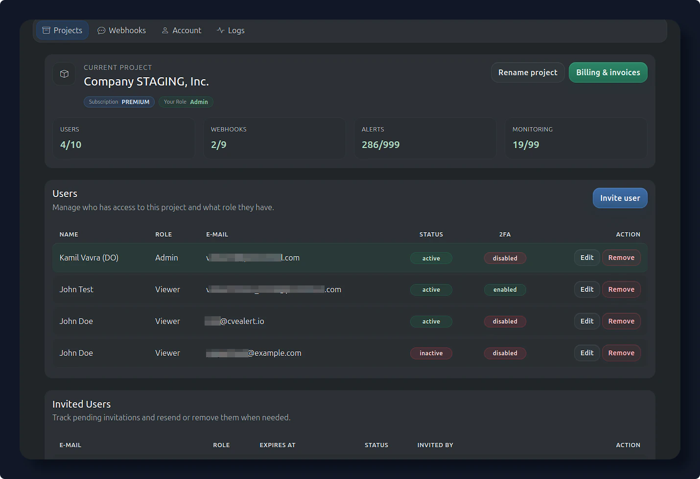

# Application Preview

This page gives a quick visual tour of the main CVEalert workspaces. Use it to understand where common onboarding and triage tasks happen in the app.

## Software Catalog

Use [Software Catalog](software/catalog/){ data-preview } to browse known software and add relevant products to monitoring.

{ loading=lazy }
/// caption
Add software to monitoring
///

---

## Software Monitoring

Use [Software Monitoring](software/monitoring/){ data-preview } to manage tracked software and tune alert thresholds.

{ loading=lazy }
/// caption
Manage monitored software
///

---

## Software CVEs

Use [Software CVEs](software/cves/){ data-preview } to review vulnerabilities linked to software products and narrow results by severity or exploitability signals.

{ loading=lazy }
/// caption
Search product vulnerabilities
///

---

## Alerts

Use [Alerts](app/alerts/){ data-preview } to triage vulnerabilities detected across monitored software.

{ loading=lazy }
/// caption
Triage detected vulnerabilities
///

---

## CVE Detail

Use [CVE Detail](app/cve/){ data-preview } to investigate severity, affected software, remediation guidance, references, and exploitation context for one CVE.

{ loading=lazy }
/// caption
Investigate one vulnerability
///

---

## Dashboard

Use [Dashboard](app/dashboard/){ data-preview } to check recent alerts, severity trends, affected software, and security news at a glance.

{ loading=lazy }
/// caption
Recent alerts and trends
///

---

## Integrations

Use [Integrations](settings/integrations/){ data-preview } to send CVE alerts to Slack or Telegram.

{ loading=lazy }
/// caption
Configure alert integrations
///

---

## Organization

Use [Organization](settings/organization/){ data-preview } to manage the workspace, members, limits, and billing context for your team.

{ loading=lazy }
/// caption
Manage organization settings
///

<!-- 
---

Do you want to see more?

[Registration](https://cvealert.io/login/){ .md-button .md-button--primary } &nbsp; [Contact](https://cvealert.io/contact/){ .md-button } 
-->

<!-- 
<video controls playsinline style="width:100%; height:auto;">
  <source src="/assets/todo.mp4" type="video/mp4">
  Your browser does not support the video tag.
</video>
-->
