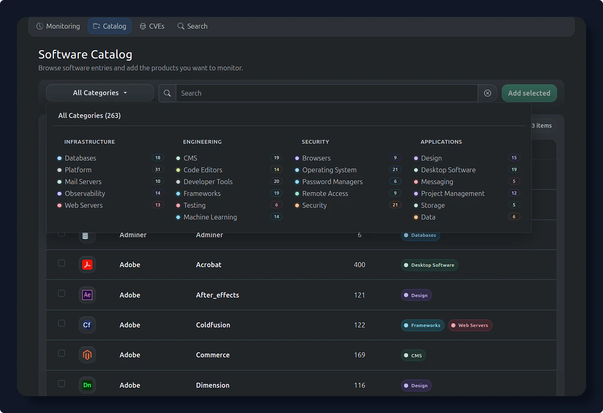
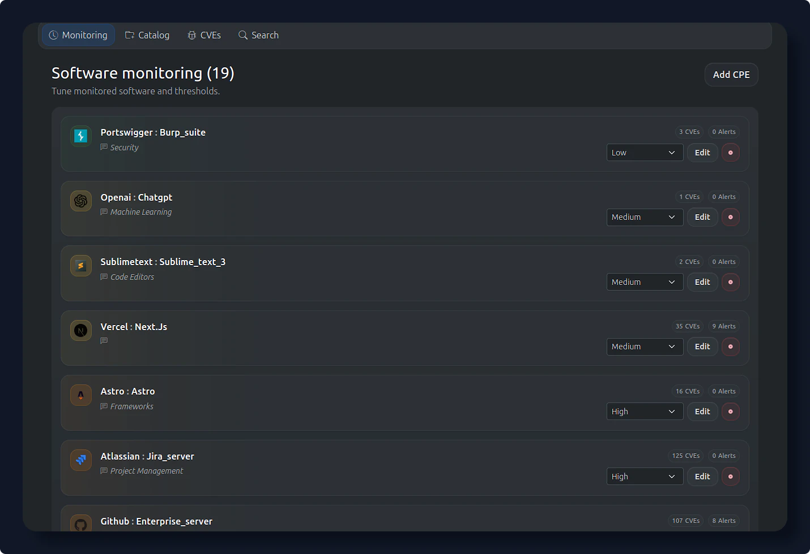
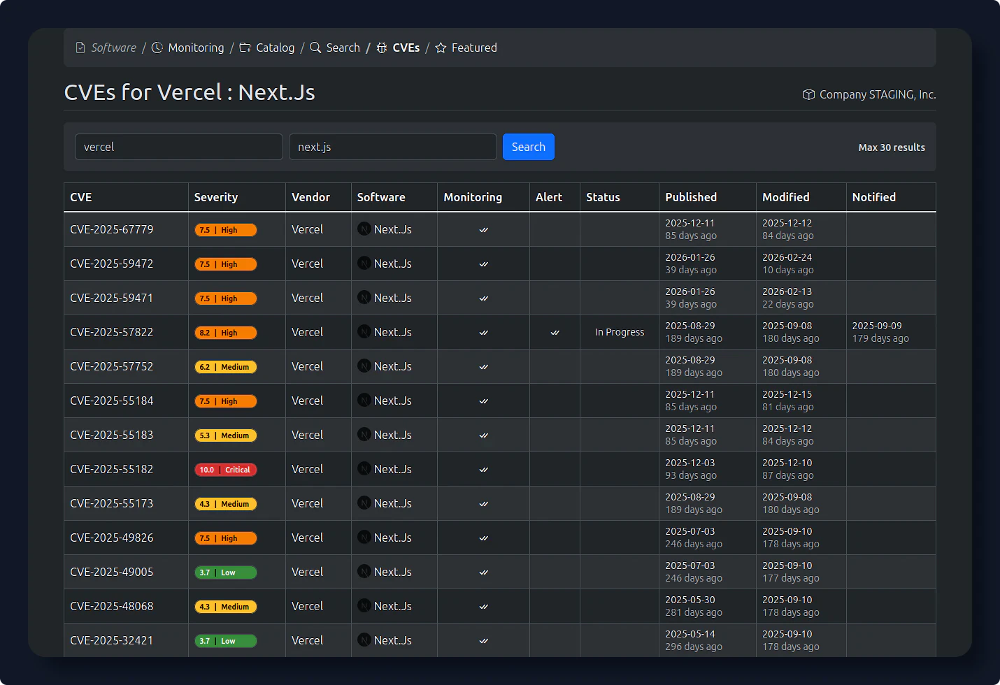
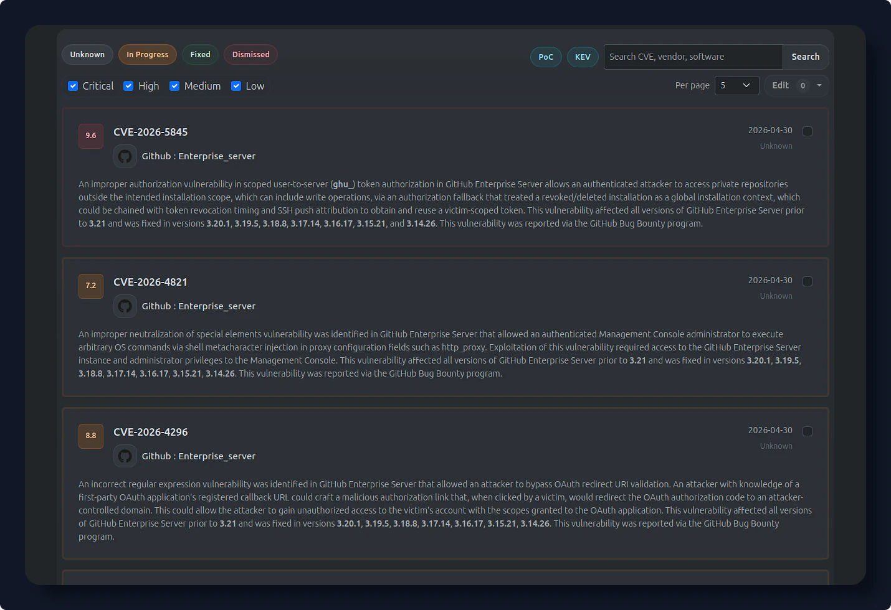
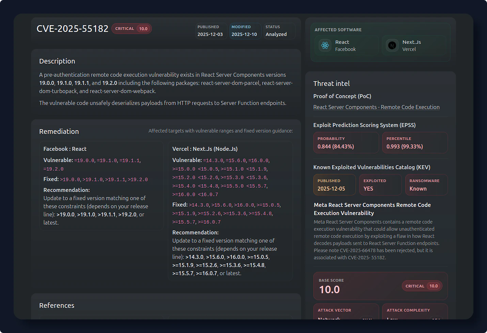
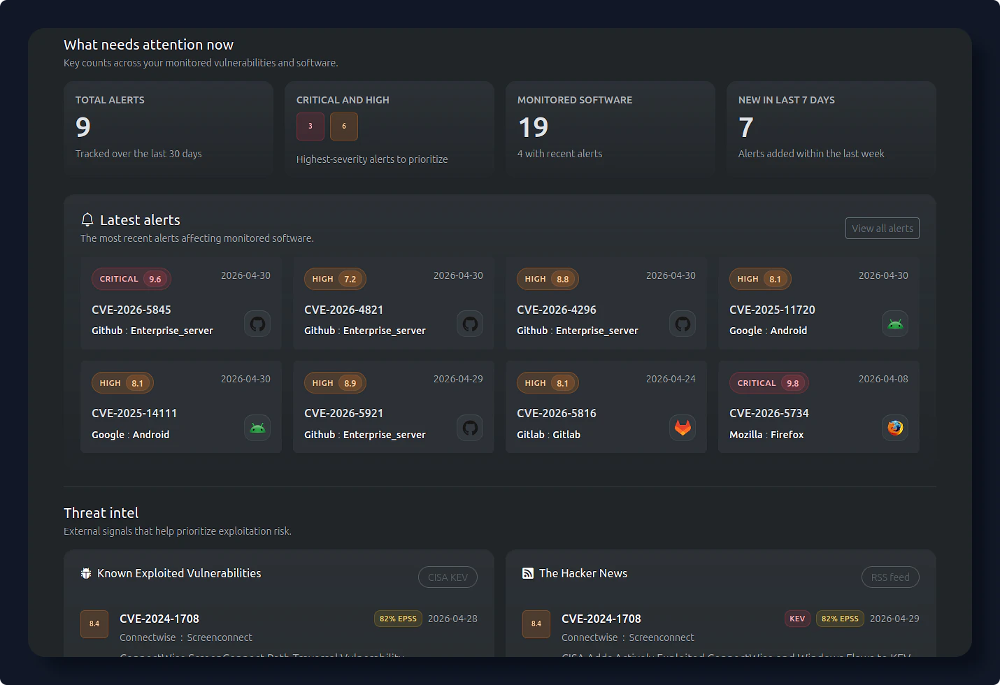
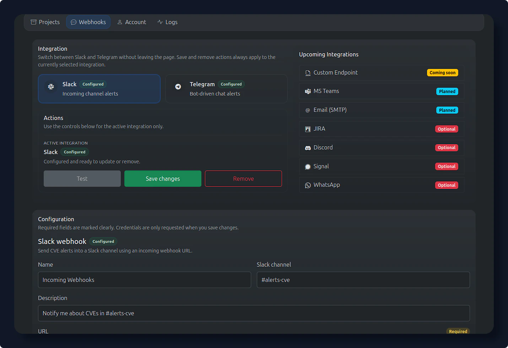
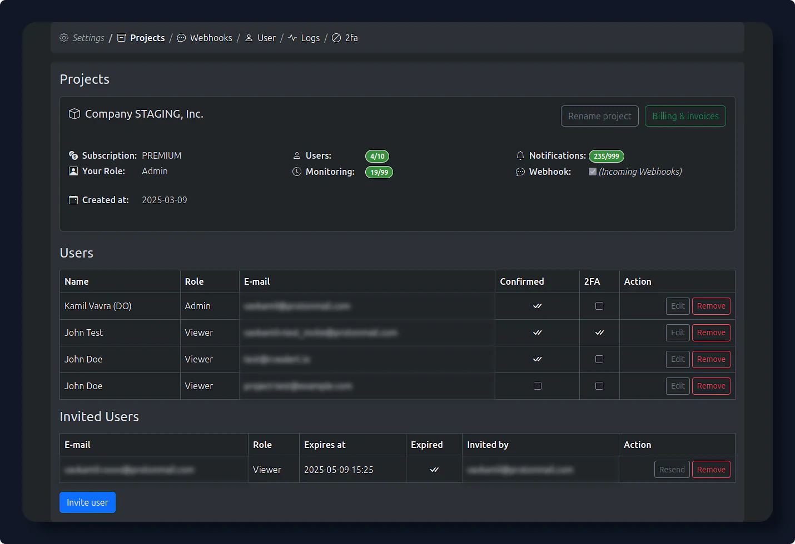

# Application Preview

The [Software Catalog](software/catalog/){ data-preview } lets you quickly discover, filter, and add commonly used software to your monitoring list.

{ loading=lazy }
/// caption
**Software Catalog** - add software to monitoring
///

---

The [Software Monitoring](software/monitoring/){ data-preview } page allows you to control which software products your organization monitors for newly disclosed security vulnerabilities (CVEs).

{ loading=lazy }
/// caption
**Software Monitoring** - manage monitored software
///

---

The [Software CVEs](software/cves/){ data-preview } for a Software page shows all known Common Vulnerabilities and Exposures (CVEs) associated with a specific software product.

{ loading=lazy }
/// caption
**CVEs** - search product vulnerabilities
///

---

The [Alerts](app/alerts/){ data-preview } page is your main workspace for monitoring, prioritizing, and managing security vulnerabilities detected across your software stack.

{ loading=lazy }
/// caption
**Alerts** - triage detected vulnerabilities
///

---

[CVE Detail](app/cve/){ data-preview } foo TODO

{ loading=lazy }
/// caption
**CVE detail** - view vulnerability details
///

---

The [Dashboard](app/dashboard/){ data-preview } is your central monitoring hub in CVEalert.io. It gives you a real-time overview of recent vulnerability alerts, severity trends, affected software, and industry security news.

{ loading=lazy }
/// caption
**Dashboard** - recent alerts and trends
///

---

[Webhooks](settings/webhooks/){ data-preview } allow you to receive real-time CVE alerts directly in your communication tools, enabling fast response to newly disclosed vulnerabilities.

{ loading=lazy }
/// caption
**Webhooks** - configure alert integrations
///

---

[Projects](settings/projects/){ data-preview } are the main workspace in CVEalert. Each project represents a company, team, or environment and defines who has access and what is being monitored.

{ loading=lazy }
/// caption
**Projects** - manage organization settings
///

---

Do you want to see more?

[Registration](https://cvealert.io/login/){ .md-button .md-button--primary } &nbsp; [Contact](https://cvealert.io/contact/){ .md-button } 

<!-- 
<video controls playsinline style="width:100%; height:auto;">
  <source src="/assets/todo.mp4" type="video/mp4">
  Your browser does not support the video tag.
</video>
-->
