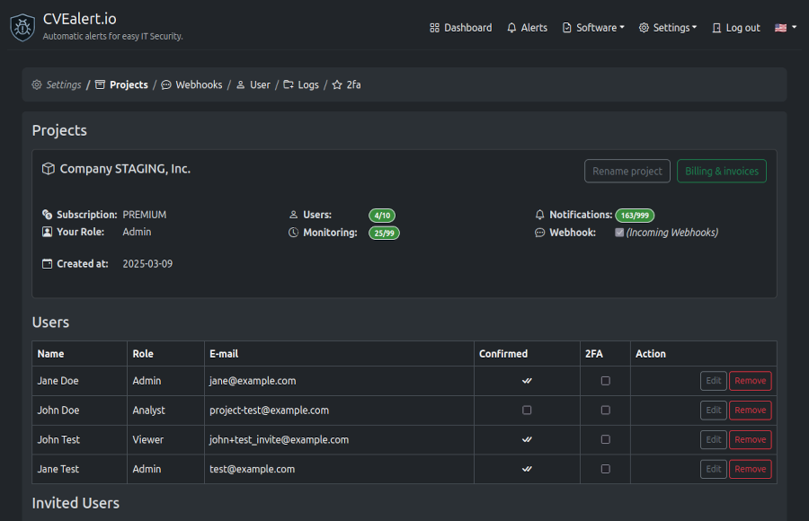

# Projects

Projects are the main workspace in CVEalert.  
Each project represents a company, team, or environment and defines **who has access** and **what is being monitored**.

All monitoring, alerts, users, and integrations belong to a project.

---

## Project Overview

The **Project Overview** section gives you a snapshot of your project configuration and usage.

Here you can see:

- **Project name** and creation date
- **Subscription plan**
- **Your role** within the project
- **User limits** and current usage
- **Monitoring limits** and current usage
- **Notification usage**
- **Webhook status**

From this page, project administrators can also:

- Rename the project
- Access **Billing & invoices**
- Manage users and invitations

---

## Users

The **Users** section lists everyone who currently has access to the project.

For each user, you can view:

- Name and email address
- Assigned role
- Account confirmation status
- Two-Factor Authentication (2FA) status

Admins can:

- Edit user roles
- Remove users from the project

---

## Invited Users

The **Invited Users** section shows pending or expired invitations.

Each invitation includes:

- Email address
- Assigned role
- Invitation expiration date
- Who sent the invite
- Current invitation status

Admins can resend or remove invitations at any time.

---

## Invite Users

To add a new user to a project:

1. Enter the user’s email address
2. Select a role
3. Send the invitation

The invited user will receive an email and must accept the invite before gaining access to the project.

Invitations automatically expire if not accepted.

---

## Roles & Permissions

Project access is controlled using roles.  
Each role determines what a user can see and manage within the project.

### Admin

Admins have **full access** to the project.

They can:

- Manage users and roles
- Configure monitoring
- View and manage alerts
- Configure webhooks and notifications
- Access billing and invoices
- Modify project settings

This role is best suited for project owners and security administrators.

---

### Analyst

Analysts have **read and write access** to most project features.

They can:

- Add and manage monitored software
- View alerts and CVE details
- Configure notifications
- Work with monitoring and security data

Analysts **cannot** manage billing or critical project settings.

This role is ideal for security and engineering team members.

---

### Viewer

Viewers have **read-only access**.

They can:

- View monitored software
- View alerts and CVE information
- Browse dashboards and reports

Viewers **cannot** make changes or modify settings.

This role is suitable for stakeholders who need visibility without making changes.

---

> 🔐 Tip: Use the **Viewer** role for auditors or managers, and reserve **Admin** access for a small number of trusted users.
