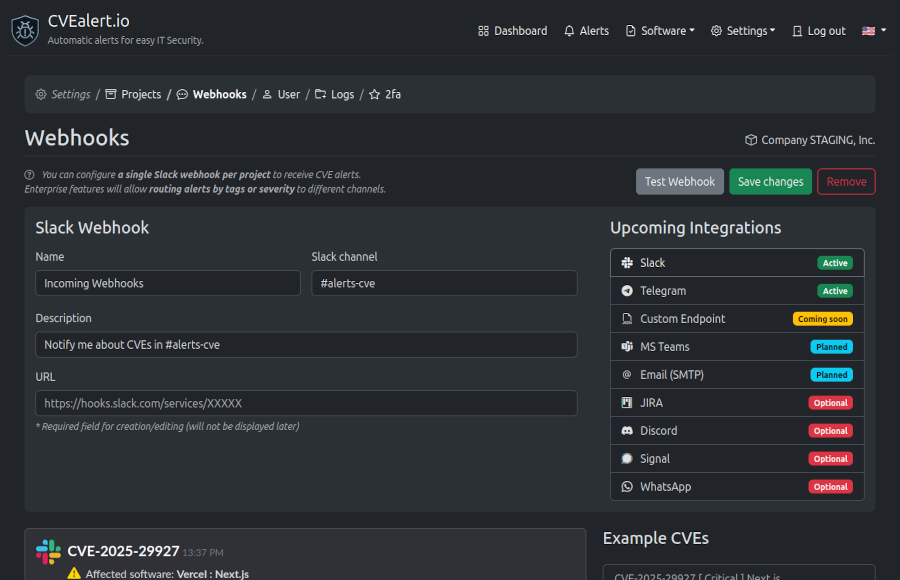

# Webhooks

Webhooks allow you to receive **real-time CVE alerts** directly in your communication tools.

Use webhooks to notify your team instantly when new vulnerabilities affect software you’re monitoring.

---

## Overview

Each project can be configured with **one incoming webhook**.

Currently, CVEalert supports **Slack webhooks**.  
Additional integrations are planned and will be available in future releases.

Webhooks are triggered automatically whenever:

- A new CVE is published
- A CVE affects software in your monitoring list
- CVE severity or details are updated

---

## Slack Webhook

Slack webhooks let you receive CVE alerts directly in a Slack channel.

### Configuration Fields

When configuring a Slack webhook, you’ll need to provide:

- **Name**  
  A friendly name for the webhook (e.g. `Incoming Webhooks`)

- **Slack channel**  
  The channel where CVE alerts will be posted (e.g. `#alerts-cve`)

- **Description**  
  Optional description to explain the purpose of the webhook

- **Webhook URL**  
  Your Slack **Incoming Webhook URL**  
  This value is required and is stored securely.

> 🔒 For security reasons, the webhook URL is not displayed after saving.

---

## Testing a Webhook

Use the **Test Webhook** button to send a sample CVE alert to your configured channel.

This is useful to:

- Verify the webhook URL
- Confirm channel permissions
- Preview the alert format

No real monitoring data is affected during testing.

---

## Managing Webhooks

From the Webhooks page, you can:

- **Save changes** to update the webhook configuration
- **Remove** the webhook to stop all webhook notifications
- Re-test the webhook at any time

Changes take effect immediately.

---

## Alert Format

Webhook alerts include key information such as:

- CVE ID
- Severity level
- Affected software
- Direct link to the CVE details page

This allows teams to quickly assess impact and take action.

---

## Upcoming Integrations

The following integrations are planned or optional and will be available in future updates:

- Telegram
- Custom HTTP Endpoint
- Microsoft Teams
- Email (SMTP)
- JIRA
- Discord
- Signal
- WhatsApp

Availability and configuration options may vary by plan.

---

> 💡 Tip: Use a dedicated Slack channel for CVE alerts to keep security notifications visible without disrupting team discussions.
