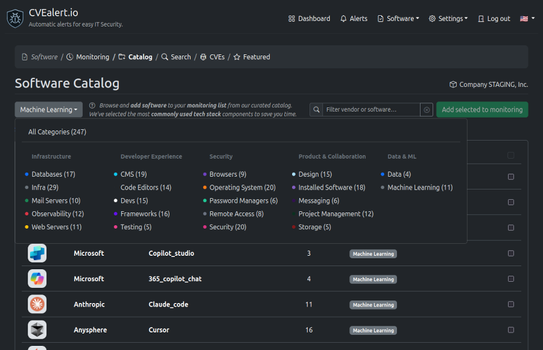

# Software Catalog

The **Software Catalog** lets you quickly discover, filter, and **add software** to your **monitoring list**.

We curate the most commonly used tools across **modern tech stacks** so you can start monitoring vulnerabilities without manual setup or guesswork.

---

## What You Can Do

From the Software Catalog, you can:

- Browse a curated list of popular software and services
- Filter software by category, vendor, or name
- Explore software grouped by use case (e.g. Frameworks, Databases, Security)
- Add selected software to your monitoring list
- Instantly see how many known CVEs are associated with each tool

---

## Browsing the Catalog

Each row in the catalog shows:

- **Vendor** – The company or organization maintaining the software  
- **Software** – The product or project name  
- **CVEs** – Number of known vulnerabilities currently tracked  
- **Categories** – One or more classifications describing the software  
- **Selection checkbox** – Used to add software to monitoring

This makes it easy to understand *what the software is*, *where it belongs*, and *why it matters* from a security perspective.

---

## Filtering & Search

Use the search bar at the top of the catalog to:

- Search by **vendor name**
- Search by **software name**
- Quickly narrow down large lists

This is especially useful when you already know what you’re looking for.

---

## Categories Overview

Software is grouped into high-level categories to help you explore by purpose or team ownership.

### Infrastructure
Core systems and backend components that power your environment.

- Databases  
- Infra  
- Mail Servers  
- Observability  
- Web Servers  

---

### Developer Experience
Tools commonly used by engineering teams during development.

- CMS  
- Code Editors  
- Devs  
- Frameworks  
- Testing  

---

### Security
Software related to system access, authentication, and protection.

- Browsers  
- Operating System  
- Password Managers  
- Remote Access  
- Security  

---

### Product & Collaboration
Tools that support teamwork, communication, and delivery.

- Design  
- Installed Software  
- Messaging  
- Project Management  
- Storage  

---

### Data & ML
Data platforms and machine learning frameworks.

- Data  
- Machine Learning  

---

## Adding Software to Monitoring

To start monitoring software:

1. Select one or more items using the checkboxes on the right
2. Click **Add selected to monitoring**
3. The software is now tracked for new CVEs and security alerts

Once added, you’ll receive alerts whenever new vulnerabilities are discovered.

---

## Why Use the Software Catalog?

- ✅ No manual CVE research  
- ✅ Covers the most common tools used in production  
- ✅ Organized by real-world use cases  
- ✅ Helps security and engineering teams stay aligned  

The Software Catalog is designed to get you from **zero to monitored** in just a few clicks.

---

> 💡 Tip: Start by adding the core infrastructure and frameworks your team relies on most, then expand as needed.
